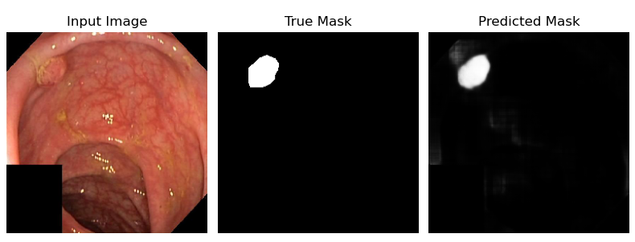
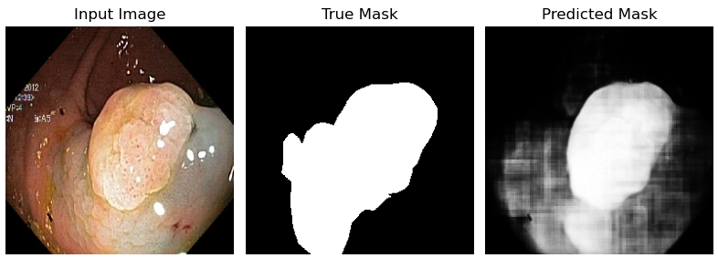

# Investigating Machine Learning Methods on Kvasir Dataset

Table of Contents
* Introduction
* Dataset Description
* Project Structure
* Setup and Installation
* Data Preprocessing
* Challenges and Limitations
* Results
* References


## Introduction
* Objective: This project investigates various machine learning (ML) techniques to classify endoscopic images from the Kvasir dataset. The goal is to evaluate different methods for classifying gastrointestinal diseases using this dataset and compare their performance.
The models investigated include:
* U-Net
* A smaller U-Net model
* Mobile U-Net
* A smaller mobile U-Net model
* DuckNet
* A smaller DuckNet model

## Dataset Description
Kvasir Dataset: The Kvasir dataset is a collection of images acquired through endoscopy, representing different anatomical landmarks, pathological findings, and therapeutic interventions.

Dataset Description
Dataset Overview:
Number of images: [e.g., 8,000+]
Categories: [e.g., Normal Z-line, Esophagitis, Polyp, Ulcer, etc.]
Image Size: Variable (commonly resized for model training)
Source: The Kvasir dataset is publicly available at Kvasir Dataset Repository.


# Setup and Installation
Prerequisites
Python (>=3.9)
Libraries: TensorFlow, Matplotlib, OpenCV, etc.
Installation:


Clone the repository:
```
git clone https://github.com/your-repo/ml-kvasir-investigation.git
cd ml-kvasir-investigation
```

Install dependencies:
```
pip install -r requirements.txt
```
Download the Kvasir dataset from the Kvasir website and extract it into the data/ folder.

## Challenges and Limitations
Initially I tried using the U-Net model for this problem. However, due to pc limitations I could only run a batch size of 4. This led to an unstable gradient and poor validation error. To compensate I tried increasing momentum and reducing the initial learning rate. Both methods gave no success. 
The best validation accuracy was around 84%.

To solve the problems from above, I tried reducing the size of the model. I reduced the depth of the U-Net by 1. This halfed the number of parameters and greatly reduced the amount of activation maps stored in memory. As a result, I could double batch size. So far this has led to a stable gradient. At the current moment we have acheived a validation accuracy of 94%. This may be able to be increased with a greater amount of training.

I implemented a Mobile U-Net model. This model had 6 million parameters (much less than the U Net's 30 million parameters). However, similarly to U-Net only a batch size of 4 could be used due to memory issues. Most the memory is used in the intermediate layers storing the activations for back propogatation.

Here I tried to get around the memory constraints by applying a range of strategies. First I tried using a float16 precision and a mixed float16 precision. This should reduce the memory by half, however this has not been successful.

In order to get around the memory issues, I tried implementing gradient checkpointing. There for a model of depth n, only $\sqrt n$ of the activations are stored (these are called checkpoints). When backpropogating we use the checkpoints to calculate the missing activations. This should result in 20-30% increased training time but with significant reduction in memory stored. 
In practice this has not been successful. Training speed has more than doubled and the loss does not improve and remains at an infinite value. I have stored the code in the model_training.ipynb and within the models directory. I plan to revist this code sometime in the future. 

To have a form of comparison to my U-net model, I have also implemented the DuckNet model. DuckNet is an image segmentation model inspired by U-net. What sets it appart from U-net are it duck blocks. Each duck block has multiple groups of filters each specialised for specific tasks. Learning from my previous mistakes I was hesitant on building the full model. However, upon inspection of the DuckNet paper, I found that the model was trained with batch size 4 an optimizer of RMSProp, initial learning rate of 0.0001, and start filter number of 17. Consequently I built the full model and trained it. Similar to the previous problems, the model struggled to converge and achieve an accuracy above 84% after 30 epochs. 

My second attempt of using DuckNet reduced the start number of filters to 10. This reduced the total number of parameters to 11 million, cutting the number of parameters down by a third. Next I switched my optimizer to Adam and doubled the batch size from 4 to 8. Finally, I switched my loss function from binary classification loss to dice loss. 


## Results
The best performance was from the Smaller U-Net Model. It is able to identify the cancerous tumours within the Pancreas. However, the model requires further training to improve it's performance.




## References
* Bi, L., Kim, J., Ahn, E. and Feng, D. (n.d.). Automatic Skin Lesion Analysis using Large-scale Der- moscopy Images and Deep Residual Networks. [online] Available at: https://arxiv.org/pdf/1703.04197 [Accessed 18 Aug. 2024].
* Ronneberger, O., Fischer, P. and Brox, T. (n.d.). U-Net: Convolutional Networks for Biomedical Image Segmentation. [online] Available at: https://arxiv.org/pdf/1505.04597.
* Dumitru, R.-G., Peteleaza, D. and Craciun, C. (2023). Using DUCK-Net for polyp image segmentation. 13(1). doi:https://doi.org/10.1038/s41598-023-36940-5.
